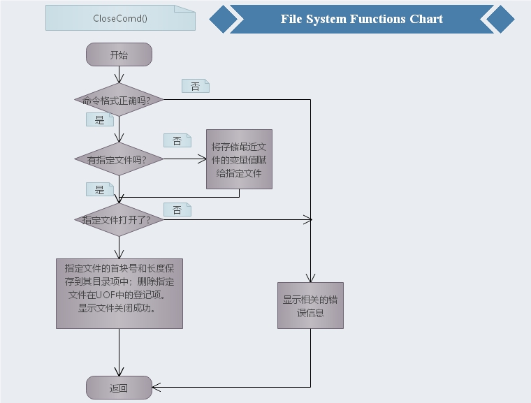
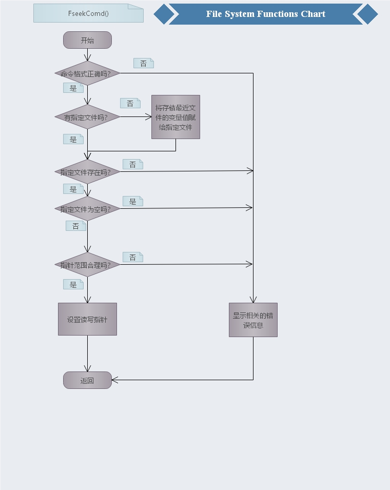
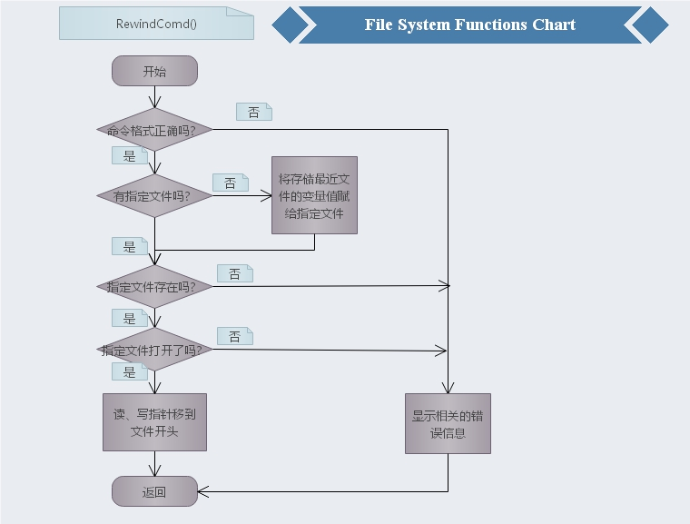
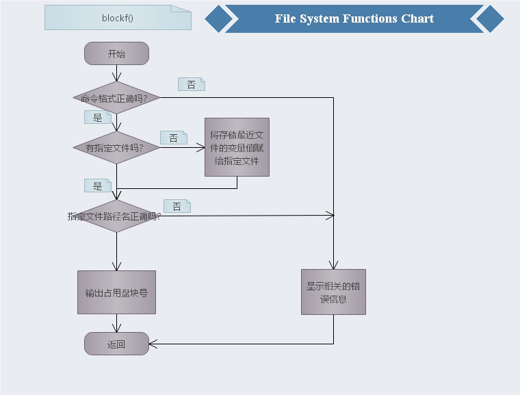
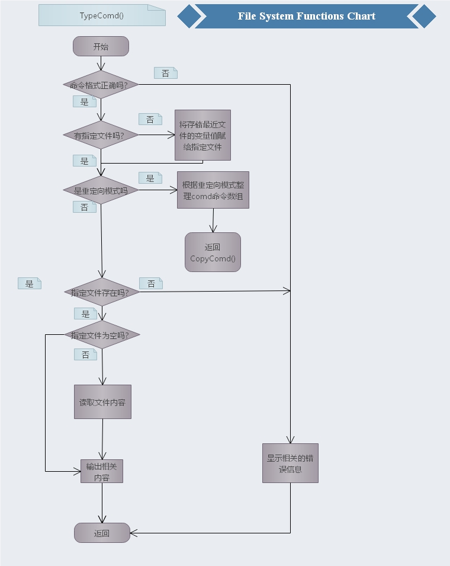
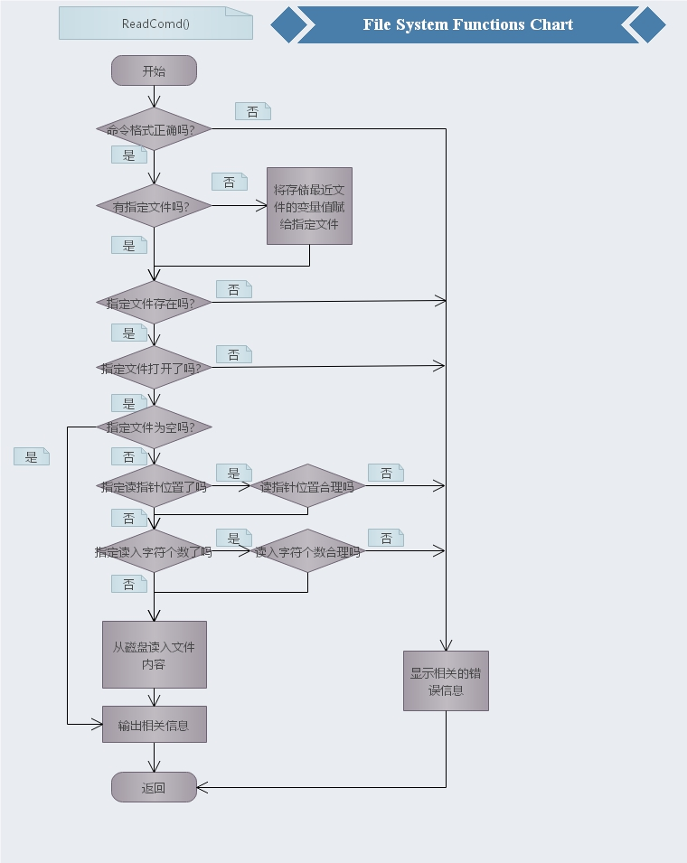
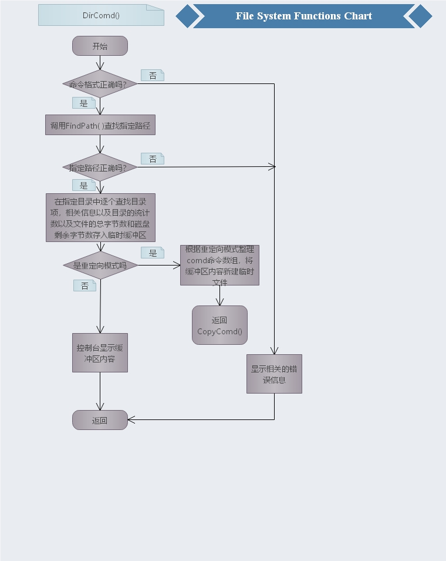
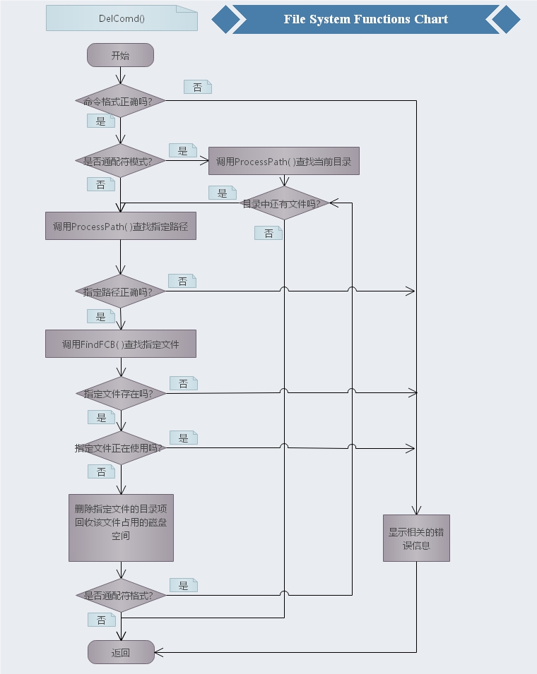

# 初次阅读请先看目录下的操作系统原理实验指导书2016.doc!!!!!!!!!!!!!
关于本系统的基本结构与使用包含在其中

# 关于完成指导书中新增内容的测试及报告
## 具体介绍

### MdComd() 4.1

**新增：**

**修改md命令，增加“属性”参数，用于创建指定属性的子目录。命令形式如下：**

 **`md <目录名>[ <属性>]`**

**属性包括R、H、S以及它们的组合(不区分大小写，顺序也不限)。例如：**

**`md user rh`**

**其功能是在当前目录中创建具有“只读”和“隐藏”属性的子目录user。**

<hr>

#### 流程图


<hr>

#### 主要思想


归功于GetAttrib函数，将属性参数如“rh”、“sRh”等合法属性作为行参传入，通过或运算即可将对应的char数值分配给其fcb，实现在仅有一子节的情况下仍能有序表示不同属性的目录。关键代码：

```c++
char ar = (char)1, ah = (char)2, as = (char)4;
for (; i < len; i++){
   switch (str[i]){
   case 'r':
       attrib = attrib | ar;
       break;
   case 'h':
       attrib = attrib | ah;
       break;
   case 's':
       attrib = attrib | as;
       break;
   default:
       cout << "\n命令中属性参数错误。\n";
       return -1;
	}
}
```

<hr>

#### 数据展示

```powershell
C:/>attrib *
/
  bin <DIR>  普通
  usr <DIR>  普通
 auto        普通
radoapx <DIR>  普通
  dev <DIR>  普通
  map        普通
C:/>md dir0 r //如下创建三个特殊文件夹，再attrib查看当前目录所有文件的权限，显示成功
C:/>md dir1 hr 
C:/>md dir2 hsr 
C:/>attrib *    
/
  bin <DIR>  普通
  usr <DIR>  普通
 auto        普通
radoapx <DIR>  普通
  dev <DIR>  普通
 dir0 <DIR>   R
  map        普通
 dir1 <DIR>   RH
 dir2 <DIR>   RHS
```

### Cdcomd() 4.2

**新增：**

**修改命令行预处理函数ParseCommand( )，使以下命令行(命令与参数间无空格符)可以正确执行：**

  **cd/**

  **cd..**

  **dir/usr**

  **copy/usr/boy mail**

**即命令名称与后边的“/”或“..”之间不需要空格也能正确执行。**

<hr>

#### 主要思想


遍历comd[0]\(仅存放命令名的数组)，如存在“/”则可判定采用了缩写空格的形式，则将数组从此位置截断，整个comd[]\[]顺次往后平移一个单位，使comd[0]中被截断的部分存入comd[1].

```c++
if (k > 0)
        for (j = k; j > 0; j--)
            strcpy(comd[j + 1], comd[j]); //后移
strcpy(comd[1], &comd[0][i]);//comd[0]中被截断的部分存入comd[1].
comd[0][i] = '\0';//截断处需要置空
k++; //多出一个参数所以需要++
```

<hr>

#### 数据展示

```powershell
C:/>cd/usr
C:/usr>cd..
C:/>dir/usr
The Directory of C:/usr
..      <DIR>
user      <DIR>
lib      <DIR>
bin      <DIR>
0 file(s) 0 bytes 4 dir(s)    1262592 free
C:/>dir>a //将dir显示的内容重定向到a文件
C:/>open a
文件/a打开成功。
C:/>read //阅读a文件
The Directory of C:/
bin      <DIR>
usr      <DIR>
auto   0
radoapx      <DIR>
dev      <DIR>
dir0      <DIR>
map   66
2 file(s) 66 bytes 5 dir(s)    1262592 free //所有命令均无空格
```

### fcComd() 4.3

命令形式：`fc <文件名1> <文件名2>`

命令功能：逐个字节比较指定的两个文件，若相同，显示“文件内容相同”字样；若不同，显示第一个不同字节的位置和各自的内容。若文件不存在则报错。

<hr>

#### 流程图


<hr>

#### 主要思想


该函数还是比较简单的，判定比较的两个文件均合法且能打开后即可比较，无需将他们全部读入内存，可直接按盘块比较，如不相同，再按子节比较不同的那一盘块，记录不一样位置的值，将其输出即可。

```c++
while (firstFileBlock > 0){
    if (strcmp(Disk[firstFileBlock], Disk[secondFileBlock]) != 0){//逐盘比较
        for (int i = 0; i < SIZE; i++){
            if (Disk[firstFileBlock][i] != Disk[secondFileBlock][i]){//逐子节比较
                cout << "文件内容不同：\n";
                cout << "位置：" << m * SIZE + i << "\n";
                cout << "文件" << FileName1 << ":'" << Disk[firstFileBlock][i] << "'\n";
                cout << "文件" << FileName2 << ":'" << Disk[secondFileBlock][i] << "'\n";
                return 0;
            }
        }
    }
    m++;
    firstFileBlock = FAT[firstFileBlock];
    secondFileBlock = FAT[secondFileBlock];
}
```

<hr>

#### 数据展示

```powershell
C:/>create a //创建a、b两个文件
文件/a建立成功

C:/>write
请输入写入文件的内容(最多允许输入10240个字节)：
123456

C:/>create b
文件/b建立成功

C:/>write
请输入写入文件的内容(最多允许输入10240个字节)：
123455

C:/>fc a b
文件/a已经打开，不能比较! //创建完a、b后没关闭，则报错

C:/>closeall
文件/a已关闭.
文件/b已关闭.
共关闭 2 个文件.

C:/>fc a b   //比较内容成功
文件内容不同：
位置：5      //位置从0开始
文件a:'6'
文件b:'5'
```

### replaceComd() 4.4

命令形式：replace <文件名> <目录名>

命令功能：以“文件名”指定的文件，取代“目录名”指定目录中的同名文件。

请按以下要求设计replace命令的函数：

+ 若指定文件或被取代文件不存在，则报错；

+ 若被取代的是只读属性的文件时，应询问用户；
+ 具有隐藏和系统属性的文件不能被取代；
+ 若目录名参数缺省，则取代当前目录的同名文件；
+ 文件名指定的文件和被取代的文件不应该是同一个文件，即不能自己取代自己。

<hr>

#### 流程图

<hr>

#### 主要思想


首先检查取代文件存在合法性，其次严格检查被取代文件的合法性，是否存在、是否打开、属性是否允许被取代等，检查无误则可以回收被取代文件的旧盘块，分配新盘块，复制取代文件的内容并修改被复制文件的fcb即可。

```c++
while (firstFileBlock > 0) //开始复制文件内容{
    b = getblock();
    if (b0 == 0)
        fcbp2->Addr = b; //目标文件的首块号
    else
        FAT[b0] = b;
    memcpy(Disk[b], Disk[firstFileBlock], SIZE); //复制盘块
    firstFileBlock = FAT[firstFileBlock];        //准备复制下一个盘块
    b0 = b;//下一个盘块
}
```

<hr>

#### 数据展示

```powershell
C:/>replace map / 
指定文件和被取代文件是同一个文件，不能自己取代自己。

C:/>replace map /usr //在usr目录不存在map文件的情况下取代报错！
被取代文件不存在。

C:/>cd/usr
C:/usr>create map 
文件/usr/map建立成功 //在usr文件夹下新建map文件

C:/usr>replace map /usr 
文件/usr/map已经打开，不能进行取代!

C:/usr>close
关闭文件/usr/map成功。

C:/usr>replace map /usr 
指定文件和被取代文件是同一个文件，不能自己取代自己。 //在usr目录下取代自己报错
C:/usr>cd..    //返回根目录再取代

C:/>replace map /usr 
C:/>cd /usr
C:/usr>type map //usr目录下的map原本是空文件，现在有了根目录下的map文件的内容
safsiodcsachsshisadsankcnsakvnsakciafshdhsaidhsaudygsafyugsvdsav d
```

### moveComd() 4.5

命令形式：move <文件名> <目录名>

命令功能：将“文件名”指定的文件或目录，移动到“目标名”指定目录中(名字保持不变)。此命令也可改变子目录名。“文件名”指定被操作的文件或目录，可以是目录名；“目录名”指定“文件名”的新位置或子目录的新名字，即必须是目录名，不能是文件名。文件或子目录转移时不能改名。

l 若转移的是一个文件，且目录名指定的目录原来已经存在，则将该文件转移到指定目录中；若指定目录中有同名文件，则询问是否覆盖，若同意则覆盖之。

l 若转移的是一个子目录，而“目录名”指定的子目录不存在，则move命令执行子目录改名操作(必须是同一目录内)；若指定目录存在，则将“文件名”指定的目录转移到该目录中，但若指定目录中存在与“文件名”指定的目录同名的子目录，则报错。

move命令的要点归纳如下：

(1) 文件或目录，无重名时，可转移到目标目录中(只能同名转移，转移必定是不同目录的)；

(2) move命令可对子目录改名，但不能用于文件改名(改名操作必定是同目录进行的)；

(3) 转移时，文件可覆盖文件，目录也可覆盖文件；但文件或目录都不能覆盖目录。

应用举例：

① 将当前目录中的子目录lin，改名为chen，可输入如下命令：

​    move lin chen

【注】前提是lin是当前目录中的一个子目录，而当前目录中无chen子目录和chen文件。

② 将当前目录中的子目录lin，转移到子目录/bin中，可输入如下命令：

​    move lin /bin

【注】前提是lin是当前目录中的一个子目录，而根目录中已存在子目录bin，且/bin中无名字为lin的子目录。此命令可覆盖子目录/bin中的名字为lin的文件(要询问用户)。

③ 将目录/usr中的文件boy，转移到当前目录下的bin子目录中，可以输入如下命令：

​    move /usr/boy bin

【注】前提是boy是目录/usr中的一个文件，而当前目录中已存在子目录bin，且bin中无名字为boy子目录。若bin目录中已存在文件boy，则询问用户是否覆盖。

<hr>

#### 流程图


<hr>

#### 主要思想


相对于replace，move则更为简单，无需复制内容直接将移动文件的fcb撤销，目标文件的fcb的首盘块号指向移动文件的首块号即可。对于更名，只需修改fcb即可，覆盖则回收已存在文件的盘块后，在进行迁移。

```c++
*fcbp = *fcbp1;                  //将第一个目录的fcb复制进新的目录下
fcbp1->FileName[0] = (char)0xe5; //删除1文件的fcb
cout << "迁移成功";
```

<hr>

#### 数据展示

```powershell
C:/>dir
The Directory of C:/
bin      <DIR>
usr      <DIR>
auto   0
radoapx      <DIR>
dev      <DIR>
boy   12
map   66
3 file(s) 78 bytes 4 dir(s)    1263104 free
C:/>move radoapx rado //给当前目录下的文件夹改名
改名成功
C:/>dir
The Directory of C:/
bin      <DIR>
usr      <DIR>
auto   0
rado      <DIR> //改名成功
dev      <DIR>
boy   12
map   66
3 file(s) 78 bytes 4 dir(s)    1263104 free
======================================================
C:/>move bin /usr //同名目录报错
有同名目录，无法迁移
C:/>move /usr bin 
迁移成功
C:/>dir //将根目录下usr目录放入bin目录下，再次dir则usr目录消失
The Directory of C:/
bin      <DIR>
auto   0
rado      <DIR>
dev      <DIR>
boy   12
map   66
3 file(s) 78 bytes 3 dir(s)    1263104 free
C:/>cd bin
C:/bin>dir //usr目录出现在bin目录下
The Directory of C:/bin
..      <DIR>
usr      <DIR>
0 file(s) 0 bytes 2 dir(s)    1263104 free
C:/bin>dir usr //查看移动后的usr目录
The Directory of C:/bin/usr
..      <DIR>
user      <DIR>
lib      <DIR>
bin      <DIR>
0 file(s) 0 bytes 4 dir(s)    1263104 free
===========================================================
C:/>dir usr 
The Directory of C:/usr
..      <DIR>
user      <DIR>
lib      <DIR>
bin      <DIR>
bot   21 //当前usr目录下有bot文件
1 file(s) 21 bytes 4 dir(s)    1262848 free

C:/>move /usr/bot bin //将bot迁移到bin目录中
迁移成功
C:/>dir usr //usr目录下无bot文件
The Directory of C:/usr
..      <DIR>
user      <DIR>
lib      <DIR>
bin      <DIR>
0 file(s) 0 bytes 4 dir(s)    1262848 free

C:/>dir bin //bin目录下有bot文件
The Directory of C:/bin
..      <DIR>
bot   21
1 file(s) 21 bytes 1 dir(s)    1262848 free
```

### batchComd() 4.6

命令形式：batch batchfile

命令功能：从磁盘文件batchfile逐行读入命令行执行，直到batchfile中所有命令行都执行完毕为止。

batchfile是一个预先编好的文本文件，其内容是多条可执行命令。例如，预先编好文本文件test.txt，其内容为：cd /usr dir type boy copy boy user/box

则执行命令batch test.txt，系统将依次自动执行cd /usr、dir、type boy和copy boy user/box四条命令，跟你用键盘依次输入上述四条命令的执行过程和执行效果完全相同。

<hr>

#### 流程图


<hr>

#### 主要思想


为了存储真实磁盘文件或文件系统虚拟内部磁盘的文件，我设置了一个全局命令循环数组BatchComds，main函数每执行一个命令循环都会检查此数组中是否存在命令，如存在则会自动执行直到此数组为空，当执行batch命令时，文件中的内容会被读入此数组，一条命令为一行，由于是循环数组，所以除非触及容量上限，否则不会有边界问题，对于文件中也存在batch的嵌套命令，此举也能处理，只是原本二级树形命令结构变为了线性结构，命令运行顺序不变。

```c++
while (ff.getline(BatchComds[BatchHeader], INPUT_LEN))//从真实磁盘读入
while (n < fileSize) //从模拟磁盘读入
{
	for (; i < SIZE; i++){
  	if (Disk[fileBlock][i] == '\n'){//说明到了一条命令的结尾
  	    n++;
  	    i++;
  	    break;
  	}
  	else{//命令未到结尾，继续复制内容
  	    comds[j++] = Disk[fileBlock][i];
  	    n++;
  	}
  	if (n == fileSize){
  	    j++;
  	    break;
  	}
	}
  if (i == SIZE || i == SIZE - 1)//判断状态是盘块结束还是命令到了结尾
  {
      fileBlock = FAT[fileBlock]; //准备读下一个盘块
      i = 0;
  }
  if (i <= SIZE - 1)
  {
      comds[j] = '\0';
      strcpy(BatchComds[BatchHeader], comds);
      BatchHeader = (BatchHeader + 1) % BATCHNUM; //将命令放入缓冲区
      if (BatchRail == BatchHeader)
      {
          cout << "batch缓冲区已满，请缩短命令行数或增大缓冲区，已经读入的将被执行。" << endl;
          BatchHeader--;
          return -1;
      }
      j = 0;
      memset(comds, 0, sizeof(comds));
	}
}
```

<hr>

#### 数据展示

```powershell
//使用真实磁盘
//创建ba.txt
//内置如下内容
md a
cd a
dir
create b
write
//然后调用命令显示如下
C:/>batch ba.txt
从真实磁盘读入ba.txt
C:/>md a
C:/>cd a
C:/a>dir
The Directory of C:/a
..      <DIR>
0 file(s) 0 bytes 1 dir(s)    1262592 free
C:/a>create b
文件/a/b建立成功
C:/a>write
请输入写入文件的内容(最多允许输入10240个 
字节)：
asdasf
C:/a>
//使用模拟磁盘
//创建文件batch
//内容为
cd /usr
dir
type boy
copy boy user/box
//运行命令后：
C:/>batch batch s
从模拟磁盘读入batch
C:/>cd /usr
C:/usr>dir
The Directory of C:/usr
..      <DIR>
user      <DIR>
lib      <DIR>
bin      <DIR>
bot   21
boy   11
box   0
3 file(s) 32 bytes 4 dir(s)    1261824 free
C:/usr>type boy
this is boy
C:/usr>copy boy user/box
```

### CloseComd() 4.7

`close <文件名>`

关闭文件。若指定文件已打开，则关闭之，即从UOF中删除该文件对应的表项。若文件未打开或文件不存在，分别给出有关信息。

**新增:允许不带文件名参数**

<hr>


#### 流程图




<hr>


#### 数据展示

```powershell
C:/>create file
文件/file建立成功

C:/>write
请输入写入文件的内容(最多允许输入10240个字节)：
file1 has an apple;

C:/>close
关闭文件/file成功。 //如展示，可以不加文件名关闭最近使用文件
```

### fseekComd() 4.7

`fseek <文件名> <n>`将读、写指针移到指定位置n处

**新增:`fseek <n>` 允许不带文件名参数**

<hr>


#### 流程图




<hr>


#### 数据展示

```powershell
C:/>fseek file 3 //给文件file制定读写指针为3

C:/>read //读取文件信息发现设置为3成功
readp:3
fsize:19
writep:3
fname:/file
le1 has an apple;

C:/>fseek 5 //不指定文件名给文件file制定读写指针为3     

C:/>read //读取文件信息发现设置为5成功
readp:5
fsize:19
writep:5
fname:/file
1 has an apple;
```

### RewindComd() 4.7

`rewind <文件名>` 对指定读、写指针移到文件开头，同时该文件变为当前操作文件

**新增:`rewind` 不加文件名格式**

<hr>


#### 流程图

#### 


<hr>


#### 数据展示

```powershell
C:/>read file
readp:33
fsize:32
writep:33
fname:/file
读指针已指向文件尾部，无可读信息。 //可以看到file文件读指针为33

C:/>rewind
文件/file读指针设定为1,写指针设定为1

C:/>read
readp:1
fsize:32
writep:1
fname:/file
asdsaoifjoishfoishfosdahorder02f //可以看到rewind成功把读写指针设为1
```

### Blockf() 4.7

`block <文件名>`显示文件或目录占用的盘块号

**新增:`block`不指定文件名形式**

<hr>


#### 流程图




<hr>

#### 数据展示

```powershell
C:/>block file

/file占用的盘块号为：56  

C:/>block

/file占用的盘块号为：56  
```

### TypeComd() 4.7 4.9

`type <文件名>` 显示指定文件内容

**新增：**

**`type` 显示当前操作文件内容(4.7)**

**`type <文件名1> > <文件名2>`**

**`type > <文件名2>`**

**将最近打开文件指定的文件内容，保存到“文件名2”指定的文件中。文件名2指定文件的原先内容被删除。这相当于复制文件。(4.9)**

**`type <文件名1> >> <文件名2>` **

**`type >> <文件名2>` **

**将最近打开文件指定的文件内容，保存到“文件名2”指定的文件中。文件名2指定文件的原先内容不删除，新内容接到原先内容尾部。这相当于合并复制文件。(4.9)**

<hr>

#### 流程图




<hr>

#### 主要思想


由于">"将最近打开文件指定的文件内容，保存到“文件名2”指定的文件中。文件名2指定文件的原先内容被删除。这相当于复制文件。">>"将最近打开文件指定的文件内容，保存到“文件名2”指定的文件中。文件名2指定文件的原先内容不删除，新内容接到原先内容尾部。这相当于合并复制文件。所以在发现得到type的命令后，根据是">"还是">>"，重新整理命令comd数组，使得comd的格式符合CopyComd的要求，因为这些功能全部包含在**改进后的copy函数**内，所以再调用copy函数即可解决问题。

<hr>

#### 数据展示

```powershell
C:/>type file
file1 has an apple; //正常在控制台输出文件file的内容

C:/>type file > new //将file中内容覆盖到new文件中(如无new文件则新建，本例为新建)

C:/>type new //查看重定向后生成的new文件
file1 has an apple;

C:/>type file>>new  //将file中内容追加到new文件中(如无new文件则新建，本例为追加)，重定向符号之间无空格也可正常运行。   

C:/>type new //查看追加后的new文件，加上之前type file > new的一遍，正好是两遍。
file1 has an apple;file1 has an apple;
```

### ReadComd() 4.15

`read <文件名> [<位置m>] [<字节数n>]` 从已打开的文件读文件内容并显示。若
“位置”参数，则从读指针所指位置开始读。若有"位置"参数，则从指定位置处开始读。位
置m是指从文件开头第m个字节处读（m从1开始编号）。若无"字节数"参数，则从指定位置读
到文件末尾；若有"字节数n"参数，则从指定位置开始读n个字节。每读一个字节，读指针后
移一个字节。若文件未打开或文件不存在，分别给出错误信息。
`read <文件名> `读指定文件，从读指针位置开始读到文件尾部
`read <文件名> |pm `读指定文件，从指定位置m开始读到文件尾部
`read <文件名> |ln `读指定文件，从读指针位置开始读n个字节
`read <文件名> |pm |ln` 读指定文件，从指定位置m开始读n个字节

**新增:**

**允许不带文件名参数:(4.15)**

**`read` 读当前操作文件，从读指针位置开始读到文件尾部**

**`read |pm |ln` 读当前操作文件，从指定位置m开始读n个字节**

**`read |pm` 读当前操作文件，从指定位置m开始读到文件尾部**

**`read |ln` 读当前操作文件，从读指针位置开始读n个字节**

**`|pm |ln`的顺序可以任意**

<hr>

#### 流程图




<hr>

#### 主要思想


系统全局设置一个最近使用文件表，记录最新使用的文件，运行命令时如发现未指定文件，则将最近使用文件放入命令。

<hr>

#### 数据展示

```powershell
C:/>read |p1 
file1 has an apple; //制定p为1，即从头读到尾

C:/>read |l3 |p2   
ile // 从位置p=2开始读l=3个字符，与上例比较符合要求（p、l顺序可以互换）

C:/>read |p4 |l12 // 从位置p=4开始读l=12个字符，符合要求
e1 has an ap
```

### WriteComd() 4.16 4.17

`write <文件名> [<位置>[ |ins[ert]] [|app[end]] [|del[ete]] ]`
命令中若无“位置”参数，则在写指针所指位置写入文件内容；若提供“位置”参数，则在对应位置写入内容。位置可以是整数n，是指在文件的第n个字节处开始写入(位置从1开始编号)。
**新增:**

**4.7**

**将本次处理文件写入最近文件变量**

**4.16 允许不带“文件名”参数**

**`write` 在写指针当前所指位置写，写入内容代替原内容(代替方式或改写方式)**
**`write |pn ` 在文件开头第n个字节处写，改写方式**
**`write |ins` 在写指针所指位置写，写入处开始的原内容后移(插入方式)**
**`write |pn |ins` 在文件开头第n个字节处写，插入方式**
**`write |app` 在文件尾部写(添加方式)**

**4.17 增加“删除”方式**

**`write <文件名> |del` 对指定文件，从写指针位置删除到文件末尾**
**`write |del` 对“当前操作文件”，从写指针位置删除到文件末尾**
**`write <文件名> |lm |del` 对指定文件，从写指针位置开始，删除m个字节**
**`write |lm |del`  对“当前操作文件”，从写指针位置开始，删除m个字节**
**`write <文件名> |pn |del` 对指定文件，从指定位置n处开始删除到文件末尾**
**`write |pn |del` 对“当前操作文件”，从指定位置n处开始删除到文件末尾**
**`write <文件名> |pn |lm |del` 对指定文件，从指定位置n处开始删除m个字节 **
**`write |pn |lm |del` 对“当前操作文件”，从指定位置n处开始删除m个字节**

<hr>

#### 流程图


<hr>

#### 主要思想


+ 4.16 系统全局设置一个最近使用文件表，记录最新使用的文件，运行命令时如发现未指定文件，则将最近使用文件放入命令。
+ 4.17 在判定用户输入｜del删除后，就无须等待用户输入这样的环节，直接检查默认或用户指定的删除范围是否合法，如合法则直接将此范围的子节置空，如此范围之后还有数据，则无需置空直接将范围后的数据向前平移覆盖，并在最后置上'\0'。

<hr>

#### 数据展示

本例测试点较多，为便于展示，创建一file文件，内容为“this is file at 20191229!”,所有测试命令按序进行，即命令叠加（比较是否正确以上一条命令的结果为基准）。

```powershell
1.先查看原先文件内容
C:/>type file
this is file at 20191229!

2.直接运行write,写指针当前所指位置写,写指针为最后
C:/>write 
请输入写入文件的内容(最多允许输入10240个字节)：
order01
写文件/file成功.
C:/>type //写入成功
this is file at 20191229!order01

3.write |pn 在文件开头第n个字节处写，改写方式
C:/>write |p2   
请输入写入文件的内容(最多允许输入10240个字节)：
order02
写文件/file成功.
C:/>type 
torder02file at 20191229!order01 //从第二个位置改写order02成功

4.write |ins——在写指针所指位置写，写入处开始的原内容后移(插入方式)
C:/>write |p2 |inser   //insert无需输全
请输入写入文件的内容(最多允许输入10240个字节)：
order03
写文件/file成功.
C:/>type
torder03order02file at 20191229!order01 //从第二个位置插入写order03成功

5.write |app——在文件尾部写(添加方式)
C:/>write |appe //append无需输全
请输入写入文件的内容(最多允许输入10240个字节)：
order04
写文件/file成功.
C:/>type
torder03order02file at 20191229!order01order04 //尾部追加order04成功

6.write |pn |lm |del——对“当前操作文件”，从指定位置n处开始删除m个字节
C:/>write |p25 |l3 |dele //delete无需输全
删除文件/file中的部分字符成功.
C:/>type
torder03order02file at 21229!order01order04 //从p=25位置删除l=3个字符成功(019被删)

7.write |del——对“当前操作文件”，从写指针位置删除到文件末尾
C:/>fseek 3 //将写指针设置为3
C:/>write |del
删除文件/file中的部分字符成功.
C:/>type
to //从位置p=3删到末尾，确实只剩to
```

### CopyComd() 4.8 4.10 4.11

`copy <源文件名> <目标文件名>` 为目标文件建立目录项，分配新的盘块，并将源文件的内容复制到目标文件中。若目标文件与源文件所在的目录相同，则只能进行更名复制，此时目标文件名不能省；若目标文件与源文件所在的目录不同，则既可更名复制也可同名复制，同名复制时目标文件名可省。

**新增：**

**4.8**

**`copy boy / copy boy .. `等特殊路径命令可以执行**

**允许覆盖同名文件**

**4.10**

**`copy * <目标目录>` 将当前目录中的所有文件复制到目标目录中(同名复制)**

**4.11**

**`copy <文件名1>+<文件名2> [<文件名3>]` 文件1和文件2合并，复制到文件3中，其中文件2接到文件1的尾部(文件1、文件2不变)。若文件名3缺省，则目标文件与文件1同名。若文件1、文件2不存在，则报错。若文件3有重名冲突，则询问用户决定是否覆盖。**

<hr>

#### 流程图


<hr>

#### 主要思想


4.8 原本的代码恰是有点问题，因为执行findFCB函数需要一个filename，但“/”或“..”恰恰是没有文件名的，所以才导致了不能执行，只需要在判定为上述情况时避开findFCB执行即可，以为其盘块号已被上一级的processPath给找到。

4.10 借助batch缓冲区，执行copy * /xxx相当于给目录内所有文件目录执行copy xxx /xxx，所以只需遍历目录所有子项，为每个子项执行一次copy即可。

4.11 检测为`copy <文件名1>+<文件名2> [<文件名3>]` 模式时，将comd命令顺序改为`copy <文件名1> [<文件名3>] <文件名2>` 的形式，则可以复用原本的逻辑，只在最后复制时在文件1的内容后追加文件2的内容,最大化简化代码。

<hr>

#### 数据展示


```c++
1.先展示三个文件file1、file2、file3，以及他们的内容
C:/usr/lib>dir
The Directory of C:/usr/lib
..      <DIR>
file1   13
file2   16
file3   16
3 file(s) 45 bytes 1 dir(s)    1260800 free
C:/usr/lib>type file1 
this is file1
C:/usr/lib>type file2
this is file2@@@
C:/usr/lib>type file3
this is file3...
    
2.将file1+file2复制到file3 copy file1+file2 file3 
C:/usr/lib>copy file1+file2 file3
是否覆盖？y/n
y
C:/usr/lib>dir
The Directory of C:/usr/lib
..      <DIR>
file1   13
file2   16
file3   29 //可以看待file3的长度变为file1+file2
3 file(s) 58 bytes 1 dir(s)    1260800 free
C:/usr/lib>type file3
this is file1this is file2@@@ //查看内容发现合并成功
    
3.存在同名目录的情况
C:/usr/lib>md dir1 //创建一个目录
C:/usr/lib>copy file1+file2 dir1 //故意把名字设为已存在目录名
C:/usr/lib>cd dir1
C:/usr/lib/dir1>dir //发现成了已存在目录的子文件
The Directory of C:/usr/lib/dir1
..      <DIR>
file1   29
1 file(s) 29 bytes 1 dir(s)    1260288 free
C:/usr/lib/dir1>type file1
this is file1this is file2@@@ //检查发现无误
    
4.目标目录内有同名目录则无法复制
C:/usr/lib/dir1>md file2
C:/usr/lib/dir1>cd ..
C:/usr/lib>copy file2+file1 dir1 
存在同名目录，无法复制。

5.在dir1目录下创建文件file3，测试目标目录下同名文件
C:/usr/lib/dir1>create file3
文件/usr/lib/dir1/file3建立成功
C:/usr/lib/dir1>write
请输入写入文件的内容(最多允许输入10240个字节)：
nanjing tech university!!!!!!!!!!!!!!!!!!!!!! //写入如左内容
C:/usr/lib>copy file3+file1 dir1 
有同名文件，是否覆盖？y/n
y
C:/usr/lib>cd dir1
C:/usr/lib/dir1>type file3
this is file1this is file2@@@this is file1 //发现合并再覆盖成功

6.copy * 通配符
C:/usr/lib/dir1>md newdir    //新建文件夹newdir
C:/usr/lib/dir1>copy * newdir //*复制所有文件到当前子目录newdir

C:/usr/lib/dir1>cd newdir
C:/usr/lib/dir1/newdir>dir
The Directory of C:/usr/lib/dir1/newdir
..      <DIR>
file1   29
file3   45
2 file(s) 74 bytes 1 dir(s)    1259008 free //发现复制成功
```

### DirComd() 4.9

命令形式：dir[ <目录名>[ <属性>]]
命令功能：显示"目录名"指定的目录中文件名和第一级子目录名。若指
定目录不存在，则给出错误信息。如果命令中没有指定目录名，则显示
当前目录下的相应内容。若命令中无"属性"参数，则显示指定目录中"非
隐藏"属性的全部文件名和第一级子目录名；若命令中有"属性"参数，则
仅显示指定属性的文件名和目录名。h、r或s或两者都有，则显示隐藏属
性或只读属性或既是隐藏又是只读属性的文件。属性参数的形式是"|<属
性符号>"，其中属性符号有r、h和s三种（不区分大小写），分别表示"只
读"、"隐藏"和"系统"三种属性,它们可以组合使用且次序不限。例如"|rh"
和"|hr"都表示要求显示同时具有"只读"和"隐藏"属性的文件和目录名。显
示文件名时，显示该文件长度；显示目录名时，同时显示"<DIR>"的字样。

**新增:**

**`dir [<目录名>] [|<属性符>] > <文件名>`**

**命令功能：将原先应该显示的指定目录中指定属性的文件名和子目录名等内容，保存到文件名指定的文件中。文件名指定文件的原先内容被删除。**

**`dir [<目录名>] [|<属性符>]  >> <文件名>`**

**命令功能：将原先应该显示的指定目录中指定属性的文件名和子目录名等内容，保存到文件名指定的文件中。文件名指定文件的原先内容不删除，新内容接到原先内容尾部。**

**增加了输出重定向功能后，增加了8种新的命令形式(这样，dir共有12种命令形式)**

<hr>

#### 流程图




<hr>

#### 主要思想

重定向时将原本输出在控制台的内容输出到指定文件(覆盖或追加)，则本质上相当于将对一个仅在内存中的无fcb的文件进行复制或追加复制，与type类似，将comd[]函数处理地符合copy的要求，然后调用copy命令即可。

<hr>

#### 数据展示


```powershell
C:/usr>dir //先dir展示usr目录内部，其中有隐藏目录默认不显示
The Directory of C:/usr
..      <DIR>
user      <DIR>
lib      <DIR>
bin      <DIR>
bot   21
boy   11
box   0
3 file(s) 32 bytes 4 dir(s)    1261056 free
C:/usr>dir |h >boy //将当前目录内h属性的内容重定向覆盖到boy文件中，重定向符可无空格
是否覆盖？y/n
y
C:/usr>type boy
The Directory of C:/usr
a      <DIR>
dir2      <DIR>
0 file(s) 0 bytes 2 dir(s)    1260288 free //确实覆盖成功

C:/usr>dir |s >>boy //再将当前目录下s属性内容追加到boy中
是否覆盖？y/n
y
C:/usr>type boy //查看boy内容，发现保留了上一条命令结果，追加成功。
The Directory of C:/usr
a      <DIR>
dir2      <DIR>
0 file(s) 0 bytes 2 dir(s)    1260288 free
The Directory of C:/usr
dir1      <DIR>
dir2      <DIR>
0 file(s) 0 bytes 2 dir(s)    1260288 free
```

### AttribComd() 4.10

`attrib <文件名> [±<属性>]` 显示修改文件属性

若命令中无"文件属性"参数，则显示指定文件的属性；若命令中有"文件属性"参数，则修改指定文件的属性。"文件属性"的形式有“+r或+h或+s”和“-r或-h或-s”两种形式，前者为设置指定文件为"只读"或"隐藏"或"系统"属性，后者为去掉指定文件的"只读"或"隐藏"或"系统"
属性。各属性可组合使用且顺序不限。例如：
`attrib user/boy +r +h`其功能是设置当前目录下user子目录中的文件boy为只读、隐藏文件。又如`attrib /usr/user/box -h -r -s`上述命令的功能是取消文件/usr/user/box的"隐藏"、"只读"、"系统"属性。
当命令中指定的文件已打开或不存在，给出错误信息；
当命令中提供的参数错误，也显示出错信息。

**新增:**

**`attrib *` 显示当前目录中所有文件和子目录的属性**

<hr>

#### 流程图

#### 

<hr>

#### 主要思想

当发现是通配符模式时，情况由原本的输出一个文件的属性变成了输出一个目录的属性，本质上没啥区别，在一个循环内遍历整个目录的盘块，将符合的子项的属性输出即可。

```c++
int block = s;
while (block > 0)
{
    fcbp = (FCB *)Disk[block];
    for (int i = 0; i < SIZE / sizeof(FCB); i++, fcbp++)
    {
        if (fcbp->FileName[0] == (char)0xe5||strcmp(fcbp->FileName,"..")==0)//如果名称未空或“..”则不需要输出
        {
            continue;
        }
        showAttribute(fcbp);//抽离出输出属性的函数方便复用
    }
    block = FAT[block];
}
```


<hr>

#### 数据展示

```powershell
C:/>attrib dir1 //正常查看目录属性
 dir1 <DIR>   RH 
C:/>attrib * //通配符模式
/
  bin <DIR> 普通
  usr <DIR> 普通
 auto       普通
radoapx <DIR> 普通
  dev <DIR> 普通
  boy       普通
  map       普通
    a <DIR> 普通
batch       普通
 file       普通
 dir1 <DIR>   RH 
 dir2 <DIR>    HS
```

### DelComd() 4.10

`del <文件名>` 删除指定的文件，即清除其目录项和回收
其所占用磁盘空间。对于只读文件，删除前应询问用户，得到同意后方能删除。当指定文件正在使用时，显示"文件正在使用，不能删除"的信息，当指定文件不存在时给出错误信息。删除文件时，将该文件的有关信息记录到删除文件恢复信息表udtab中，以备将来恢复时使用。

**新增：**

**`del *` 删除当前目录中的所有文件**

<hr>

#### 流程图




<hr>

#### 主要思想

与attrib类似，由原本的删除一个文件变成删除一个目录的文件，同样**抽离出删除一个文件的函数**，原本是调用一次，现在只需遍历整个目录的子项，每有一个符合要求的子项调用一次即可。

下面给出删除全部文件的代码：

```c++
while (block > 0)//只要当前目录未遍历完
{
    fcbp1 = (FCB *)Disk[block];
    for (int i = 0; i < SIZE / sizeof(FCB); i++, fcbp1++)
    {
        if (fcbp1->FileName[0] == (char)0xe5 || strcmp(fcbp1->FileName, "..") == 0||fcbp1->Fattrib>=(char)16)//如果此子项不符合要求，则跳过
        {
            continue;
        }
        fcbp = fcbp1;
        FileName = fcbp->FileName;
        strcpy(gFileName, curpath.cpath);
        i = strlen(temppath);
        if (temppath[i - 1] != '/')
            strcat(gFileName, "/");
        strcat(gFileName, FileName); //构造文件的全路径名
        i = Check_UOF(gFileName);    //查UOF
        if (i < S)                   //该文件已在UOF中
        {
            cout << "\n文件" << gFileName << "正在使用，不能删除!\n";
            return -3;
        }
        attr = fcbp->Fattrib & '\01';
        if (attr == '\01')
        {
            cout << "\n文件" << gFileName << "是只读文件，你确定要删除它吗？(y/n) ";
            cin >> yn;
            if (yn != 'Y' && yn != 'y')
                return 0; //不删除，返回
        }
        i = PutUdtab(fcbp); //被删除文件的有关信息保存到udtab表中
        if (i < 0)          //因磁盘空间不足，不能保存被删除文件的信息
        {
            cout << "\n你是否仍要删除文件 " << gFileName << " ? (y/n) : ";
            cin >> yn;
            if (yn == 'N' || yn == 'n')
                return 0; //不删除返回
        }
        fleshBlock(fcbp);//确定删除执行（抽离出的删除函数）
    }
    block = FAT[block];
}
```


<hr>

#### 数据展示

```powershell
C:/usr/user>dir //先查看当前目录内容
The Directory of C:/usr/user
..      <DIR>
lin      <DIR>
sun      <DIR>
ma      <DIR>
aa   0
bb   0
cc   0
dd   0
4 file(s) 0 bytes 4 dir(s)    1260288 free
C:/usr/user>del aa //删除aa
C:/usr/user>dir 
The Directory of C:/usr/user
..      <DIR>
lin      <DIR>
sun      <DIR>
ma      <DIR>
bb   0
cc   0
dd   0
3 file(s) 0 bytes 4 dir(s)    1260288 free //发现aa删除成功

C:/usr/user>del * // 执行通配符命令
C:/usr/user>dir
The Directory of C:/usr/user
..      <DIR>
lin      <DIR>
sun      <DIR>
ma      <DIR>
0 file(s) 0 bytes 4 dir(s)    1260288 free //所有文件都删除成功
```

### UndelComd() 4.14

`undel [<目录名>]` 恢复指定目录中被删除的文件
`undel` 恢复当前目录中被删除的文件

**新增:删除文件恢复表udtab不用数组存储，而直接存储在磁盘空间**

<hr>

#### 主要思想

由于磁盘块大小在4.修改UnDel的数据结构，以便udtab在磁盘中存储。例如可用如下结构：

struct UnDel    //恢复被删除文件的数据结构(共128字节)

{

  char gpath[112];      //被删除文件的全路径名(不含文件名)

  char ufname[FILENAME_LEN]; //被删除文件名

  char ufattr;        //被删除文件属性

  short ufaddr;        //被删除文件的首块号

  short fb;          //存储被删除文件长度及块号的指针(首块号)

};

每个盘块可以存放2个udtab表的表项。为方便计，udtab表的长度仍可限定为40，可在磁盘中开辟一个大小为20个磁盘块的连续存储空间存放udtab表。udtab表存储在连续的磁盘空间的优点是：可用数组的方法直接处理Disk中的udtab表。退出系统时，无需将udtab表存盘，启动系统时，无需读入udtab表。udtab的块号链的首块号记录在Disk[0]中。

<hr>

#### 数据展示


```powershell
C:/usr/user>dir
The Directory of C:/usr/user
..      <DIR>
lin      <DIR>
sun      <DIR>
ma      <DIR>
0 file(s) 0 bytes 4 dir(s)    1260288 free

C:/usr/user>undel
文件aa可能可以恢复，是否恢复它？(y/n) y
文件bb可能可以恢复，是否恢复它？(y/n) y
文件cc可能可以恢复，是否恢复它？(y/n) y
文件dd可能可以恢复，是否恢复它？(y/n) y
共恢复了 4 个被删除的文件。

C:/usr/user>dir
The Directory of C:/usr/user
..      <DIR>
lin      <DIR>
sun      <DIR>
ma      <DIR>
aa   45
bb   12
cc   3
dd   0
4 file(s) 0 bytes 4 dir(s)    1260288 free //恢复之前删除的四个文件成功

```